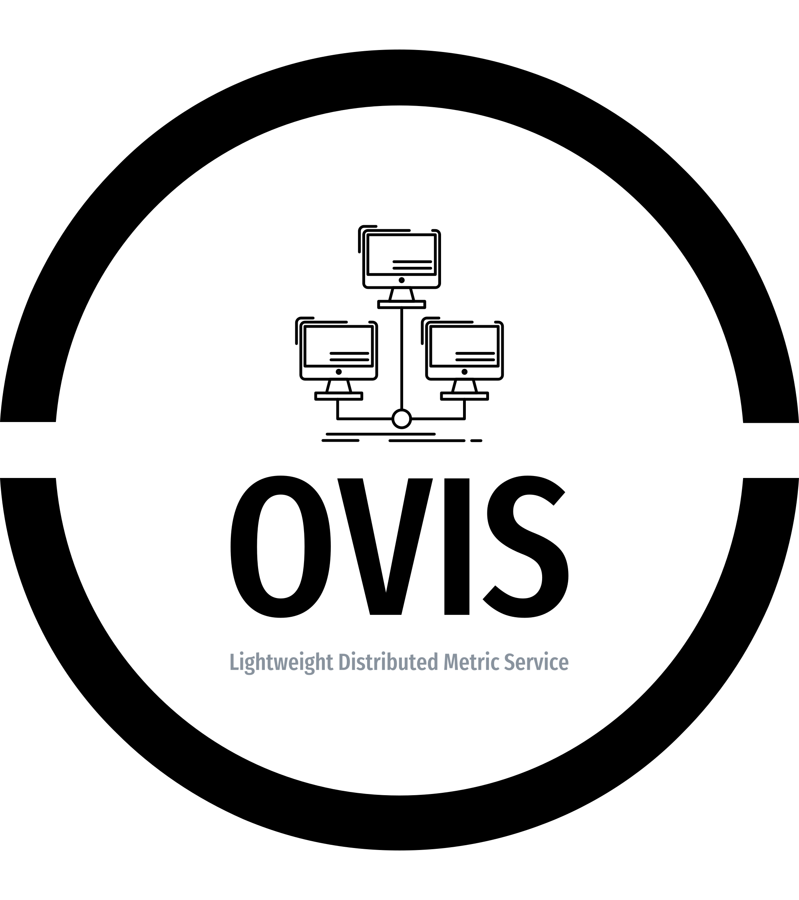

.. Copyright 2023 Sandia National Laboratories, LLC
   (c.f. AUTHORS, NOTICE.LLNS, COPYING)

   SPDX-License-Identifier: (LGPL-3.0)

.. Flux documentation master file, created by
   sphinx-quickstart on Fri Jan 10 15:11:07 2020.
   You can adapt this file completely to your liking, but it should at least
   contain the root `toctree` directive.

Welcome To OVIS-HPC Documentation!
====================================

**OVIS** is a modular system for HPC data collection, transport, storage, analysis, visualization, and log message exploration. The Lightweight Distributed Metric Service (**LDMS**) is a scalable low-overhead, low-latency framework for collection, movement, and storage of metric/event data on distributed computer systems.

.. toctree::
   :maxdepth: 2
   :caption: OVIS and Group Activity

   aboutovis
   LDMS Users Group Conference <https://ovis-hpc-personal.readthedocs.io/projects/ldms/en/latest/ldmscon.html>
   LDSM Users Group <https://ovis-hpc-personal.readthedocs.io/projects/ldms/en/latest/ug.html>
   publications

.. toctree::
   :maxdepth: 4
   :caption: OVIS Components

   LDMS <https://ovis-hpc-personal.readthedocs.io/projects/ldms/en/latest/index.html/#>
   SOS <https://ovis-hpc-personal.readthedocs.io/projects/sos/en/latest/index.html/#>
   Maestro <https://ovis-hpc-personal.readthedocs.io/projects/maestro/en/latest/index.html>
   Baler <https://ovis-hpc-personal.readthedocs.io/projects/baler/en/latest/index.html>
   deployment/index
   
Other Projects
====================================

* :doc:`sos:index`
* :ref:`sos:sos-index`

`ldms <https://github.com/ovis-hpc/ovis>`_
`ovis-publications <https://github.com/ovis-hpc/ovis-publications>`_
`maestro <https://github.com/ovis-hpc/maestro>`_
`sos <https://github.com/ovis-hpc/sos>`_
`baler <https://github.com/ovis-hpc/baler>`_

   

